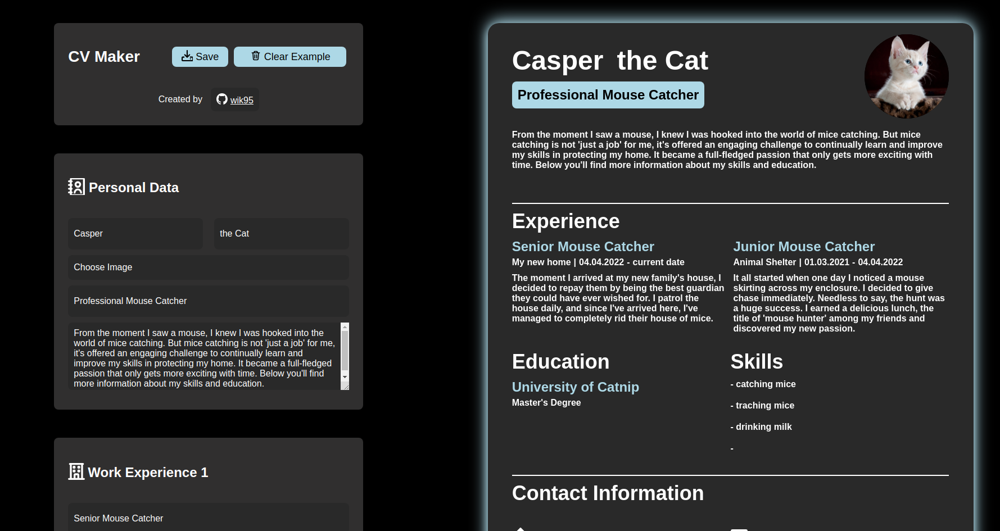
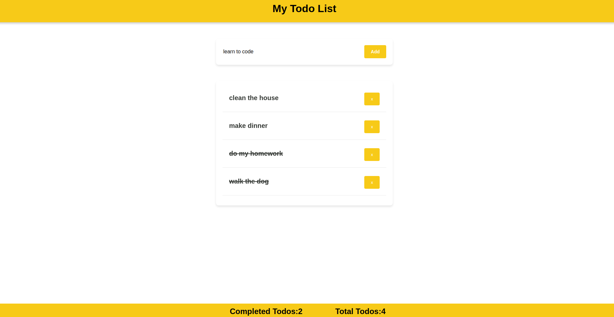
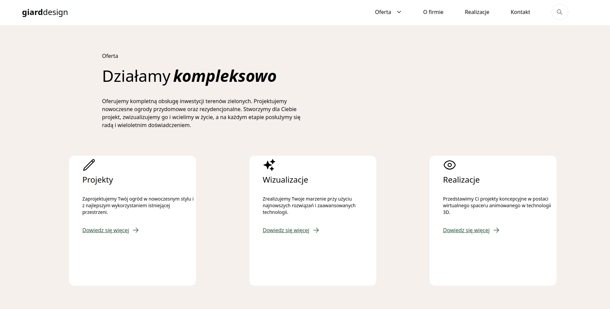

<h1 align="center">Hello, <a href="https://github.com/wik95" >I'm Wiktor</a>👋</h1>
 

  I'm a 28 year old Frontend Developer currently based in Poland. 
  Coding is something I got hooked on the moment I typed my first line of code.  
  I love the fact that I'm able to create things, simply by typing on a keyboard.  
  It's really satisfying and lets me express my creative side.  
  
  
  How to reach me:

  

   I speak:

     &ensp;
     &ensp;
    

<h2 align="center"> Languages & Tools</h2>
<h3 align='center'> Front End</h3>

       &ensp;
       &ensp;
       &ensp;
       &ensp;
      
  

  <h3 align='center'>Tools</h3>

       &ensp;
       &ensp;
       &ensp;
       &ensp;
      

<h2 align="center">Newest Projects</h2>

<h3 align="center">The latest 4 projects I worked on:</h3>

<h3 align="center">CV App</h3>

  

 

  <a href="https://github.com/wik95/cv_app_react"> 
     Repository
  </a> &ensp;
   <a href="https://wik95.github.io/cv_app_react/"> 
     Live
  </a>
  

  

     &ensp;
    
  

   

  <h3 align="center">ToDo React App</h3>

  

 

  <a href="https://github.com/wik95/todo_react"> 
     Repository
  </a> &ensp;
   <a href="https://wik95.github.io/todo_react/"> 
     Live
  </a>
  

  

     &ensp;
    
  

   

  <h3 align="center">AdRespect Project</h3>

  

 

  <a href="https://github.com/wik95/adrespect_project"> 
     Repository
  </a> &ensp;
   <a href="https://wik95.github.io/adrespect_project/"> 
     Live
  </a>
  

  

     &ensp;
    
  

   

